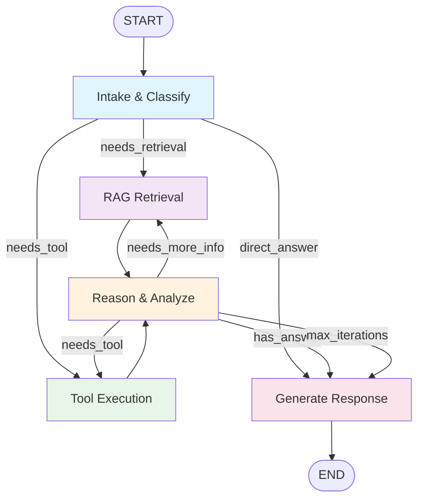

# *design-graph

Design a LangGraph state machine for complex AI agent workflows. Atlas maps workflow requirements to graph nodes, edges, and conditions, producing a validated graph design with visualization, state schema, and implementation-ready code.

## Usage

```bash
# Interactive mode (recommended)
*design-graph

# With workflow description
*design-graph --workflow "multi-step research with human review"

# From existing specification
*design-graph --spec workflows/research-agent.yaml

# Quick single-agent graph
*design-graph --mode yolo --workflow "simple RAG Q&A with fallback"
```

## Parameters

| Parameter | Type | Required | Default | Description |
|-----------|------|----------|---------|-------------|
| `workflow_requirements` | string | yes | - | Workflow description or specification |
| `agent_roles` | list | no | `["single_agent"]` | Agent roles for multi-agent workflows |
| `tool_definitions` | list | no | `[]` | Available tools |
| `mode` | enum | no | `interactive` | Execution mode: `yolo`, `interactive`, `preflight` |
| `graph_type` | enum | no | `auto` | Type: `simple`, `branching`, `cyclic`, `hierarchical`, `multi_agent` |
| `checkpoint_strategy` | enum | no | `every_node` | When to checkpoint: `every_node`, `on_decision`, `manual` |
| `human_in_the_loop` | boolean | no | `false` | Include human approval nodes |
| `visualization_format` | enum | no | `mermaid` | Format: `mermaid`, `ascii`, `dot`, `png` |

## LangGraph Concepts Reference

### Core Concepts

| Concept | Description | LangGraph Construct |
|---------|-------------|-------------------|
| **Node** | A processing step (LLM call, tool use, logic) | `graph.add_node("name", function)` |
| **Edge** | Connection between nodes | `graph.add_edge("from", "to")` |
| **Conditional Edge** | Routing based on state | `graph.add_conditional_edges("from", router_fn)` |
| **State** | Shared data across all nodes | `TypedDict` with `Annotated` reducers |
| **Reducer** | How state updates are merged | `Annotated[list, add_messages]` |
| **Checkpoint** | Saved state snapshot | `MemorySaver`, `SqliteSaver`, etc. |
| **Interrupt** | Pause for human input | `interrupt_before=["node"]` |
| **Subgraph** | Nested graph within a node | Graph as a node in parent graph |

### Graph Patterns

#### Pattern 1: Linear Pipeline
Simple sequential processing.

```
[START] -> [load] -> [process] -> [respond] -> [END]
```

#### Pattern 2: Branching (Router)
Route to different paths based on input.

```
[START] -> [classify] -> [route]
                          /    \
                   [path_a]  [path_b]
                          \    /
                        [merge] -> [END]
```

#### Pattern 3: Cyclic (ReAct Loop)
Iterate until a condition is met.

```
[START] -> [reason] -> [route] -> [tool] -> [observe] -> [reason] (loop)
                          |
                       [respond] -> [END]
```

#### Pattern 4: Hierarchical (Supervisor)
A supervisor delegates to specialized sub-agents.

```
[START] -> [supervisor] -> [route]
                          /  |   \
               [agent_a] [agent_b] [agent_c]
                          \  |   /
                       [supervisor] (re-evaluate)
                             |
                          [END]
```

#### Pattern 5: Map-Reduce
Process items in parallel and aggregate.

```
[START] -> [split] -> [map: process_item] -> [reduce] -> [END]
```

#### Pattern 6: Human-in-the-Loop
Pause execution for human review.

```
[START] -> [analyze] -> [propose_action] -> [INTERRUPT: human_review]
                                                    |
                                        [approved] / \ [rejected]
                                               |       |
                                          [execute]  [revise] -> [propose_action]
                                               |
                                            [END]
```

### State Schema Patterns

```python
from typing import TypedDict, Annotated, Literal
from langgraph.graph.message import add_messages

# Basic conversational state
class BasicState(TypedDict):
    messages: Annotated[list, add_messages]

# RAG-enhanced state
class RAGState(TypedDict):
    messages: Annotated[list, add_messages]
    context: list[str]           # Retrieved documents
    sources: list[dict]          # Source metadata
    confidence: float            # Answer confidence

# Multi-agent state
class MultiAgentState(TypedDict):
    messages: Annotated[list, add_messages]
    current_agent: str           # Active agent name
    task_queue: list[dict]       # Pending tasks
    results: dict                # Agent results
    iteration: int               # Loop counter

# Workflow state
class WorkflowState(TypedDict):
    messages: Annotated[list, add_messages]
    stage: Literal["intake", "processing", "review", "complete"]
    data: dict                   # Working data
    errors: list[str]            # Error log
    approvals: dict              # Human approvals
```

## Interactive Flow

### Step 1: Workflow Discovery

```
Atlas: Let's design your LangGraph state machine.

Describe the workflow you want to model:

  1. Simple Q&A with tools (ReAct pattern)
  2. Multi-step research with synthesis
  3. Document processing pipeline
  4. Customer support with escalation
  5. Multi-agent collaboration
  6. Approval workflow with human-in-the-loop
  7. Custom workflow: ___________

> [user input]

Follow-up: Walk me through the workflow steps.
  Step 1: [user describes]
  Step 2: [user describes]
  ...

  Are there any decision points? (yes/no)
  Are there any loops? (yes/no)
  Are there parallel paths? (yes/no)
  Is human approval needed at any point? (yes/no)
```

### Step 2: Node Identification

```
Atlas: Based on your workflow, I've identified these nodes:

  Node 1: [intake]
    - Purpose: Receive and classify incoming request
    - Type: LLM call
    - Input: User message
    - Output: Classified intent, extracted parameters

  Node 2: [retrieve]
    - Purpose: Fetch relevant context from knowledge base
    - Type: Tool call (RAG retriever)
    - Input: Query derived from classification
    - Output: Retrieved documents

  Node 3: [reason]
    - Purpose: Analyze retrieved context and formulate response
    - Type: LLM call
    - Input: Query + retrieved context
    - Output: Draft response or tool request

  Node 4: [tool_execute]
    - Purpose: Execute requested tool
    - Type: Tool call
    - Input: Tool name + arguments
    - Output: Tool result

  Node 5: [respond]
    - Purpose: Generate final response
    - Type: LLM call
    - Input: All context + reasoning
    - Output: User-facing response

Additional nodes needed?
  [ ] Error handler node
  [ ] Human review node
  [ ] Summarization node
  [ ] Logging/audit node
  [ ] Custom: ___________

> [user selection]
```

### Step 3: State Schema Design

```
Atlas: Let's define what the state machine tracks.

Based on your workflow, the state schema should include:

  Required fields:
    - messages: Conversation history (list with add_messages reducer)

  Recommended fields:
    - stage: Current workflow stage (literal type)
    - context: Retrieved documents (list[str])
    - tool_results: Results from tool calls (list[dict])
    - iteration_count: Loop counter (int)

  Optional fields:
    [ ] user_profile: User information (dict)
    [ ] confidence: Answer confidence score (float)
    [ ] sources: Source citations (list[dict])
    [ ] errors: Error log (list[str])
    [ ] metadata: Request metadata (dict)
    [ ] approvals: Human approvals tracking (dict)
    [ ] Custom field: ___________

> [user selection]

State persistence:
  1. In-memory (development, no persistence)
  2. SQLite (local, persistent)
  3. PostgreSQL (production, distributed)

> [user input]
```

### Step 4: Edge and Routing Design

```
Atlas: Now let's define how nodes connect.

=== Edge Configuration ===

  Direct edges (always follows):
    [START] -> [intake]
    [tool_execute] -> [reason]
    [respond] -> [END]

  Conditional edges (decision-based):
    [intake] -> route based on intent:
      - "needs_retrieval" -> [retrieve]
      - "needs_tool" -> [tool_execute]
      - "direct_answer" -> [respond]

    [reason] -> route based on reasoning:
      - "needs_more_info" -> [retrieve] (loop back)
      - "needs_tool" -> [tool_execute]
      - "has_answer" -> [respond]
      - "max_iterations" -> [respond] (forced exit)

  Safety conditions:
    - Max iterations: {n} (prevents infinite loops)
    - Timeout: {seconds} per node

Does this routing logic look correct? [Y/n]

Any additional conditions to add? [y/N]
```

### Step 5: Visualization and Validation

```
Atlas: Here's your graph design:

=== Graph Visualization (Mermaid) ===



=== Validation Results ===

  Completeness:
    [PASS] All nodes reachable from START
    [PASS] All paths lead to END
    [PASS] No orphan nodes
    [PASS] No dead-end paths

  Safety:
    [PASS] Maximum iteration limit configured
    [PASS] Timeout configured per node
    [PASS] Error handling node present

  State:
    [PASS] State schema covers all node inputs/outputs
    [PASS] Reducers configured for list fields
    [PASS] Checkpoint strategy defined

Graph design validated successfully!
```

### Step 6: Code Generation

```
Atlas: Generating implementation code...

  Files:
    src/graphs/
    ├── {workflow_name}/
    │   ├── __init__.py
    │   ├── graph.py          # Graph definition
    │   ├── state.py          # State schema
    │   ├── nodes.py          # Node implementations
    │   ├── conditions.py     # Routing conditions
    │   ├── config.py         # Graph configuration
    │   └── visualization.md  # Mermaid diagram

  Tests:
    tests/graphs/
    ├── test_nodes.py
    ├── test_conditions.py
    └── test_graph_e2e.py

Generate code? [Y/n]
```

## Output

### 1. Graph Definition
- Complete `StateGraph` definition with all nodes and edges
- Compiled graph with checkpointing
- Configuration file for runtime parameters
- Entry point for graph execution

### 2. Node Configurations
- Implementation for each node function
- System prompts for LLM nodes
- Tool wiring for tool nodes
- Input/output validation per node

### 3. Edge Conditions
- Router functions for conditional edges
- Decision criteria documentation
- Fallback routing for unexpected states
- Loop detection and termination logic

### 4. Visualization
- Mermaid diagram (embeddable in docs)
- ASCII representation (terminal-friendly)
- Node relationship table
- State transition matrix

## Error Handling

| Error | Cause | Resolution | Recovery |
|-------|-------|------------|----------|
| Unreachable Node | Node has no incoming edges | Add missing edge or remove orphan node | Warn during validation, suggest fix |
| Dead-End Path | Path does not reach END | Add edge to END or to continuing node | Auto-detect during validation |
| Infinite Loop | Cycle without exit condition | Add iteration counter and max limit | Force exit to response node at max iterations |
| State Schema Mismatch | Node writes field not in schema | Add missing field to state or fix node | Show which node and field conflict |
| Reducer Conflict | Multiple nodes write same field without reducer | Add appropriate reducer (replace, append) | Suggest reducer based on field type |
| Invalid Condition | Router returns value not matching any edge | Add default/fallback edge | Route to error handler node |
| Checkpoint Failure | Cannot save state to backend | Verify backend connection, retry | Continue execution, warn about state loss |
| Subgraph Import Error | Nested graph not found or invalid | Verify subgraph path and compilation | Show import error details |
| Cyclomatic Complexity | Graph too complex for reliable execution | Suggest simplification or subgraph extraction | Break into smaller, composable subgraphs |

## Pre-Conditions

```yaml
pre-conditions:
  - "[ ] Workflow requirements clearly defined"
  - "[ ] Available tools and their capabilities documented"
  - "[ ] Agent roles defined (if multi-agent)"
  - "[ ] Success criteria for workflow established"
```

## Post-Conditions

```yaml
post-conditions:
  - "[ ] Graph definition compiles without errors"
  - "[ ] All nodes reachable and all paths reach END"
  - "[ ] Conditional routing covers all possible states"
  - "[ ] Visualization accurately represents the graph"
  - "[ ] Graph logic validated for correctness"
```

## Acceptance Criteria

```yaml
acceptance-criteria:
  - "[ ] Graph models the workflow requirements completely"
  - "[ ] No unreachable nodes or dead-end paths"
  - "[ ] Loop termination conditions are in place"
  - "[ ] State schema covers all node inputs and outputs"
  - "[ ] Mermaid visualization renders correctly"
  - "[ ] Generated code compiles and passes tests"
```

## Performance

```yaml
duration_expected: 10-25 min (interactive), 5-10 min (yolo)
cost_estimated: $0.01-0.05
token_usage: ~5,000-15,000 tokens
```

## Metadata

```yaml
story: N/A
version: 1.0.0
dependencies: []
tags:
  - langgraph
  - state-machine
  - graph
  - design
  - workflow
  - visualization
updated_at: 2026-02-09
```

## Related

- **Agent:** @rag-ai-engineer (Atlas)
- **Upstream Tasks:** `*design-rag` (architecture context, if RAG agent)
- **Downstream Tasks:** `*build-agent` (implements the designed graph)
- **Collaborators:** @prompt-engineer (Lyra) for node prompts, @eval-guardian (Sage) for workflow validation
- **Checklists:** `production-readiness.md`
